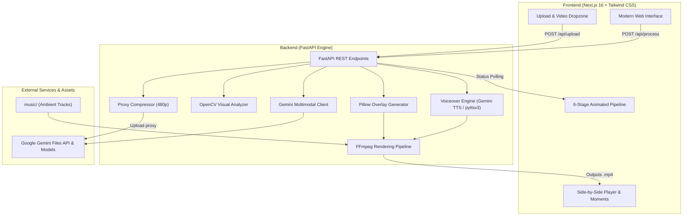

# 🎬 AI Director's Cut

<p align="center">
  <strong>Turn raw, unedited footage into a cinematic, professionally narrated highlight reel in seconds.</strong><br>
  <em>Powered by Google Gemini Multimodal AI, OpenCV, and FFmpeg.</em>
</p>

<p align="center">
  
  
  
  
  
  
</p>

---

## 🌟 Overview

**AI Director's Cut** is an automated video production studio that runs locally on your machine. Using Google Gemini's advanced multimodal video understanding alongside OpenCV visual energy heuristics, it watches your raw footage, extracts the most compelling moments, drafts professional narration, overlays broadcast-grade visual titles, and edits a cohesive highlight reel with synchronized background music and voiceover.

Everything is processed with privacy in mind: your raw files remain local, rendering is executed via FFmpeg on your machine, and only an optimized analysis stream is processed by Gemini.

---

## 🚀 Key Features

- 🧠 **Multimodal Video Intelligence**: Gemini watches the actual video frames and audio to understand context, themes, dialogue, and climactic moments.
- ⚡ **Lightweight Proxy Acceleration**: Automatically generates a 480p proxy for large files (>12MB) to ensure fast uploads (<3s), while the final render uses the original full-resolution master video.
- 🎯 **Algorithmic Scene & Energy Analysis**: OpenCV detects visual transitions, motion peaks, and camera shifts to guarantee clean cut boundaries.
- 🎙️ **Narrative Voiceover (TTS)**: Creates spoken intro and outro narrations tailored strictly to the subject matter of your video (powered by Gemini TTS with seamless offline `pyttsx3` fallback).
- 🏷️ **Broadcast Lower-Third Overlays**: Renders sleek, modern glassmorphic lower-third titles, moment indicators (`MOMENT X/Y • SCORE Z/10`), and context banners.
- 🎵 **Automated Audio Ducking**: Blends the video's native audio (45%), AI voiceover narration (100%), and optional ambient soundtrack (8%) into an audio mix.
- ⏱️ **Interactive Highlight Reel Viewer**: Side-by-side players with instant timestamp seeking to jump directly to any selected moment in the original video.
- 🛡️ **Autonomous Quota & Model Fallback**: Handles Gemini rate limits and model deprecations, falling back through model tiers (`gemini-3-flash-preview`, `gemini-3.1-flash-lite`, `gemini-flash-lite-latest`) to a robust visual heuristic engine.

---

## 🏗️ System Architecture



---

## 🔄 Complete 6-Stage Workflow

Here is exactly what happens from the moment you drop in a video to the final render:

```
[1. Upload & Validation] ──► [2. Visual Analysis] ──► [3. Gemini Story Analysis]
                                                              │
[6. Final Composition]   ◄── [5. Audio & Overlays] ◄── [4. Clipping Engine]
```

### Stage 1: Upload & Fast Validation (`/api/upload`)
1. Raw video (`.mp4`, `.mov`, `.webm`) is received and saved to `uploads/{job_id}_{filename}`.
2. `ffprobe` validates container integrity, frame rate, resolution, and total duration.
3. If the file exceeds 12 MB, a 480p proxy is generated in the background for fast analysis uploading.

### Stage 2: Visual Energy & Scene Detection
1. OpenCV samples frames at 2.0-second intervals across the video timeline.
2. Computes HSV frame differences to measure visual energy and motion dynamics.
3. Detects scene cut transitions where pixel distributions change abruptly.

### Stage 3: Gemini Multimodal Story Analysis
1. The video is uploaded to Google's Gemini Files API.
2. Gemini evaluates the video content, dialogue, and presentation flow.
3. Generates a video title, summary, spoken intro narration, spoken outro narration, and a list of highlight clips with custom titles and scores.
4. **Content-Specific Narration**: Prompts explicitly instruct Gemini that the intro and outro must discuss the video's actual topic (e.g. tech tutorial, keynote, interview) with zero platform boilerplate.

### Stage 4: Duration-Aware Clip Optimization
1. The clipping engine enforces coverage across the entire video:
   - Videos > 5m: 7 clips (~18s each, 35-45% video coverage)
   - Videos 3-5m: 6 clips (~16s each, 32-48% video coverage)
   - Videos 90s-3m: 5 clips (~14s each, 35-50% video coverage)
   - Videos 45-90s: 4 clips (~12s each, 40-55% video coverage)
   - Videos < 45s: 3 clips (~10s each, 50-70% video coverage)
2. Snaps start points to nearest OpenCV scene cuts or visual energy peaks.
3. Ensures chronological sequence and prevents overlapping segments.

### Stage 5: Voiceover & Overlay Synthesis
1. **Narration**: Generates high-fidelity spoken intro and outro audio files via Gemini TTS (or offline `pyttsx3` if quota is unavailable).
2. **Graphics**: Generates translucent PNG overlays via Pillow:
   - **Intro Card**: Video title, topic summary, and featured highlight badge.
   - **Moment Banners**: Chapter counter (`MOMENT 01/05`), rating (`SCORE 9/10`), moment title, and director's rationale.
   - **Outro Card**: Concluding summary and takeaway badge.

### Stage 6: FFmpeg Final Composition
1. Extracts clips using fast stream-copy (`-c copy`).
2. Concatenates segments into a continuous reel.
3. Uses an FFmpeg `filter_complex` graph to:
   - Layer glassmorphic graphic overlays at precise timestamps.
   - Duck video audio to 45% to provide headroom for speech.
   - Place spoken intro narration at `t=0.3s` and outro narration at `total_dur - 4.5s`.
   - Mix background ambient music at 8% with smooth fade-out.
4. Outputs the finished highlight reel in `outputs/{job_id}_highlight.mp4`.

---

## 💻 How to Run

### Prerequisites

- **Python 3.10+** (Anaconda or standard Python)
- **Node.js 18+** and **npm**
- **FFmpeg & FFprobe** installed and added to your system `PATH`
- **Google Gemini API Key** ([Get a free key here](https://aistudio.google.com/app/apikey))

#### Installing FFmpeg

- **Windows (PowerShell)**:
  ```powershell
  winget install --id Gyan.FFmpeg --exact
  ```
  *(Restart your terminal after installation so `PATH` is updated)*
- **macOS**:
  ```bash
  brew install ffmpeg
  ```
- **Linux (Ubuntu/Debian)**:
  ```bash
  sudo apt update && sudo apt install ffmpeg
  ```

---

### Step-by-Step Setup

#### 1. Clone the Repository
```bash
git clone https://github.com/your-username/ai-directors-cut.git
cd "ai-directors-cut"
```

#### 2. Configure Environment Variables
Create or edit `.env` in the root directory:
```env
GEMINI_API_KEY=your_actual_gemini_api_key_here
GEMINI_MODEL=gemini-3-flash-preview
GEMINI_TTS_MODEL=gemini-2.5-flash-preview-tts
```

#### 3. Install Backend Dependencies
```bash
cd backend
pip install -r requirements.txt
cd ..
```

#### 4. Install Frontend Dependencies
```bash
cd frontend
npm install
cd ..
```

---

### Starting the Application

#### Option A: One-Click Start (Windows)
Simply double-click:
```bat
start.bat
```
This batch script automatically launches both the FastAPI backend (port 8000) and the Next.js frontend (port 3000) in separate terminals.

#### Option B: Manual Start

**Terminal 1 — Backend (FastAPI)**:
```bash
cd backend
python -m uvicorn main:app --host 0.0.0.0 --port 8000 --reload
```
*(If using Anaconda on Windows: `& "C:\Users\<Username>\anaconda3\python.exe" -m uvicorn main:app --host 0.0.0.0 --port 8000 --reload`)*

**Terminal 2 — Frontend (Next.js)**:
```bash
cd frontend
npm run dev
```

Open your browser and navigate to: **[http://localhost:3000](http://localhost:3000)**

---

## 📁 Project Directory Structure

```
AI Directors Cut/
├── backend/
│   ├── main.py                     # FastAPI application & job pipeline controller
│   ├── models.py                   # Pydantic schemas (ClipInfo, AnalysisResult, JobStatus)
│   ├── requirements.txt            # Python package dependencies
│   ├── test_pipeline.py            # Headless testing utility
│   ├── services/
│   │   ├── analysis_service.py     # OpenCV visual energy & scene transition detection
│   │   ├── gemini_service.py       # Gemini API client, proxy manager, prompt & fallback logic
│   │   ├── overlay_service.py      # Pillow-based dynamic lower-third title card rendering
│   │   ├── render_service.py       # FFmpeg stream-copy cutting, concatenation & audio ducking
│   │   ├── tts_service.py          # Gemini TTS voice generator & pyttsx3 offline fallback
│   │   └── video_service.py        # FFprobe metadata extraction & container validation
│   └── utils/
│       ├── file_manager.py         # Directory management (uploads, temp, outputs)
│       └── job_store.py            # In-memory and persistent job state tracking
├── frontend/
│   ├── app/
│   │   ├── globals.css             # Tailwind CSS styles
│   │   ├── layout.tsx              # Root HTML & font configurations
│   │   └── page.tsx                # Master state controller (upload → processing → results)
│   ├── components/
│   │   ├── UploadSection.tsx       # Drag-and-drop zone with client validation
│   │   ├── ProcessingPipeline.tsx  # 6-stage animated progress tracker
│   │   └── ResultsPanel.tsx        # Side-by-side original/cut comparison & moment cards
│   ├── lib/
│   │   └── api.ts                  # Axios API client wrapper
│   └── package.json                # Frontend dependencies
├── uploads/                        # Staged source video files
├── temp/                           # Intermediate audio, cut clips, and overlay cards
├── outputs/                        # Final exported highlight reels
├── music/                          # Royalty-free background music tracks
├── .env                            # API keys and model configurations
├── start.bat                       # One-click Windows launch script
└── README.md                       # Documentation
```

---

## 🎵 Background Music Customization

AI Director's Cut includes a royalty-free ambient track (`music/cinematic_ambient.wav`). You can customize the background score:
1. Drop any `.mp3`, `.wav`, or `.aac` audio file into the `music/` directory.
2. The render engine automatically detects the track, loops it across the highlight reel, ducks it beneath the narration, and adds a gentle 2.0-second fade-out at the finish.

---

## 📡 API Reference

### 1. Upload Video
- **POST** `/api/upload`
- **Body**: `multipart/form-data` with `file: UploadFile`
- **Response**:
```json
{
  "job_id": "da515f9f",
  "filename": "da515f9f_presentation.mp4",
  "original_filename": "presentation.mp4",
  "file_size": 45219482,
  "status": "uploaded",
  "message": "Video uploaded successfully"
}
```

### 2. Start Processing Pipeline
- **POST** `/api/process/{job_id}`
- **Response**:
```json
{
  "job_id": "da515f9f",
  "status": "analyzing",
  "message": "Processing pipeline initiated"
}
```

### 3. Check Job Status
- **GET** `/api/status/{job_id}`
- **Response**:
```json
{
  "job_id": "da515f9f",
  "status": "rendering",
  "progress": 75,
  "message": "Rendering video, mixing audio & applying dynamic overlays...",
  "error": null
}
```

### 4. Fetch Highlight Results
- **GET** `/api/result/{job_id}`
- **Response**:
```json
{
  "job_id": "da515f9f",
  "status": "completed",
  "original_filename": "presentation.mp4",
  "output_filename": "da515f9f_highlight.mp4",
  "analysis": {
    "title": "Cloud Architecture Masterclass",
    "summary": "An in-depth breakdown of microservice scalability and modern deployment pipelines.",
    "clips": [
      {
        "start": 12.5,
        "end": 26.0,
        "overlay_title": "Core Architecture",
        "reason": "Clear explanation of distributed state management.",
        "score": 9,
        "category": "Key Discussion"
      }
    ],
    "intro": "In this session, we explore modern distributed systems and how to optimize infrastructure...",
    "outro": "Those were the defining architectural insights from this presentation. Thank you for watching!",
    "editing_notes": [
      "Distributed 5 highlights proportionally across 114s video."
    ]
  }
}
```

### 5. Stream Video
- **GET** `/api/video/{filename}`
- Supports HTTP range headers (`206 Partial Content`) for fluid playback and seeking.

---

## ⚙️ Environment Variables

| Variable | Default | Purpose |
| :--- | :--- | :--- |
| `GEMINI_API_KEY` | *(Required)* | Google Gemini API key |
| `GEMINI_MODEL` | `gemini-3-flash-preview` | Primary Gemini model for multimodal video analysis |
| `GEMINI_TTS_MODEL` | `gemini-2.5-flash-preview-tts` | Model used for high-fidelity audio narration |
| `NEXT_PUBLIC_API_URL`| `http://localhost:8000` | Backend API URL accessed by the Next.js frontend |

---

## ❓ Troubleshooting & FAQ

### 1. `Model models/gemini-2.0-flash is no longer available (404)`
Google deprecates older preview model endpoints over time. The project is configured to use active models (`gemini-3-flash-preview`, `gemini-3.1-flash-lite`, and `gemini-2.5-flash-preview-tts`). If you receive a 404, check your `.env` file and verify model availability in your region using Google AI Studio.

### 2. `Quota exceeded / 429 RESOURCE_EXHAUSTED`
The Gemini free tier has rate limits per minute. AI Director's Cut automatically:
- Detects the 429 response.
- Falls back to secondary available models.
- If TTS is exhausted, it seamlessly switches to offline `pyttsx3` speech synthesis so your video render never fails.

### 3. `FFmpeg not recognized`
Ensure FFmpeg is installed and added to your system environment `PATH`. Open a fresh terminal and run `ffmpeg -version` to verify.

### 4. Large videos take long to upload
For files larger than 12MB, the system automatically downscales a lightweight 480p proxy for analysis. Gemini analyzes the proxy in seconds, and FFmpeg cuts the final reel directly from your original full-resolution master.

---

## 📄 License

This project is open-source under the **MIT License**. Free for personal, academic, and commercial use.
